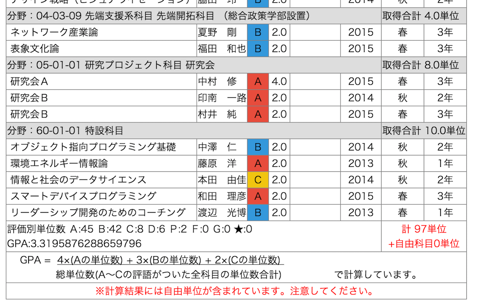

# Credits Calculator for Keio
Credits Calculator for Keio is Google Chrome Extention.  
Extending Grade Reports System of Keio Univ. Gakuji Web.

## Recent Updates
- 主語を大きく
- 評語Sに対応
- GPAの計算式を修正 (総履修単位数で割らなくてはいけない部分が総取得単位数で割るようになっていた?)
  GPA計算式について，2017年度以降入学生による検証を求む．
- 自由科目が複数分野に存在していた際に，最後の分野しか取得できていなかった問題を修正

[成績証明書における成績評価について](http://www.gakuji.keio.ac.jp/academic/shoumei/grading_system.html)
## Demo

forked from reatgcr0wn/Credits-Calculator-for-SFC
